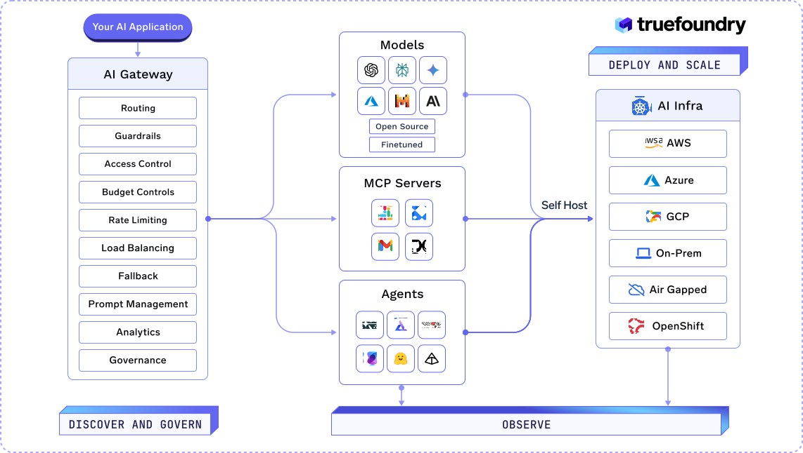

  

**[TrueFoundry](https://truefoundry.com) - Reduce time to value on Gen AI & ML initiatives**

    

---

## Govern, Deploy, Scale & Trace Agentic AI in One Unified Platform

TrueFoundry is a cloud-agnostic PaaS running on Kubernetes that standardizes agentic AI building, deployment and observability using developer-friendly APIs. Plugs and play with your existing stack without vendor lock-in bringing state of the art industry standards.

- **NEW** :fire: [Free Sign Up](https://www.truefoundry.com/register) - Sign Up for Free and Deploy on your cloud in under 10 minutes
- [AI Gateway](https://www.truefoundry.com/ai-gateway) - Enterprise-Ready AI Gateway for secure, high-performance proxy to 1000+ models with observability, governance, rate limits, budgets, guardrails, fallbacks, and load balancing. 
- **NEW** :fire: [MCP Gateway](https://www.truefoundry.com/mcp-gateway) - Secure Access to MCP Servers and Agent Orchestration
- **NEW** :fire: [Tracing](https://www.truefoundry.com/tracing) - End-to-End Observability for AI Agents and Applications
- [Model Serving and Finetuning](https://www.truefoundry.com/model-serving) - Model Serving and Finetuning for Any Model Across Any Infrastructure
- [TrueFoundry SDK & CLI](https://pypi.org/project/truefoundry/)
    - Track Experiments, register and versions models, artifacts and prompts
    - Deploy Services, Jobs, Notebooks, SSH Servers, Helm applications
    - Build and Deploy DAG workflows
    - Enable CI/CD for your deployments
    - Programmatically access TrueFoundry APIs
- [TrueFoundry Docs](https://docs.truefoundry.com)

### OpenSource

- [KubeElasti](https://github.com/truefoundry/KubeElasti) - Kubernetes-native scale-to-zero with zero traffic loss, no code changes, and direct integration with kubernetes resources
- [LLM Locust](https://github.com/truefoundry/llm-locust) - LLM Locust combines the simplicity of Locust with deep support for LLM-specific benchmarking
- [Cognita](https://github.com/truefoundry/cognita) - RAG Framework for Building Grounded Applications

## Get in touch 💬

👉 [Join our Slack community!](https://join.slack.com/t/truefoundry/shared_invite/zt-1siovkugy-yJLZF2FPz7HQjNxmKMuZSg)

🐦 Follow the latest from TrueFoundry team on Twitter [@truefoundry](https://twitter.com/truefoundry)
